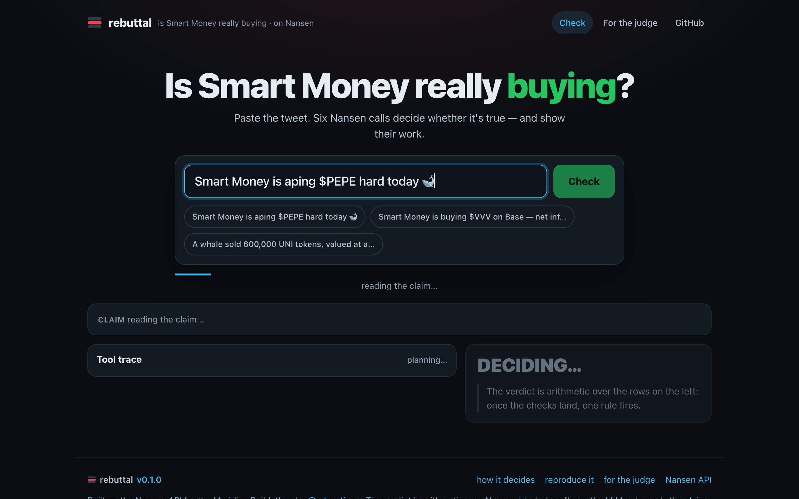
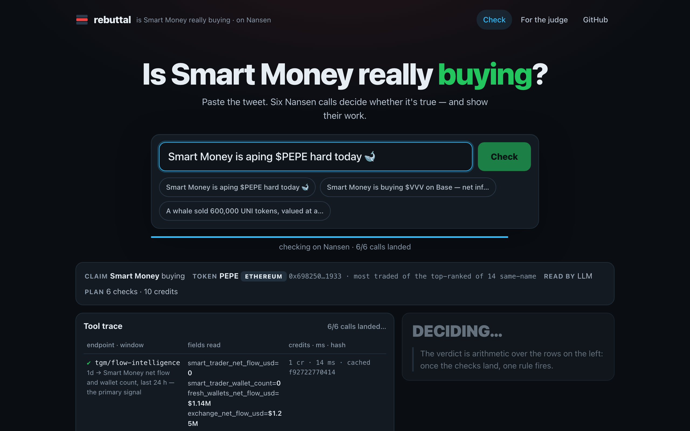
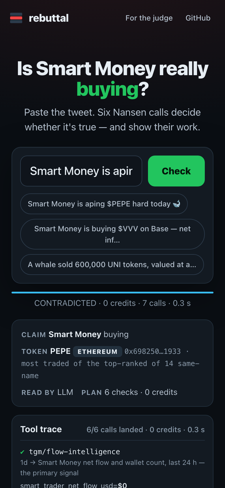
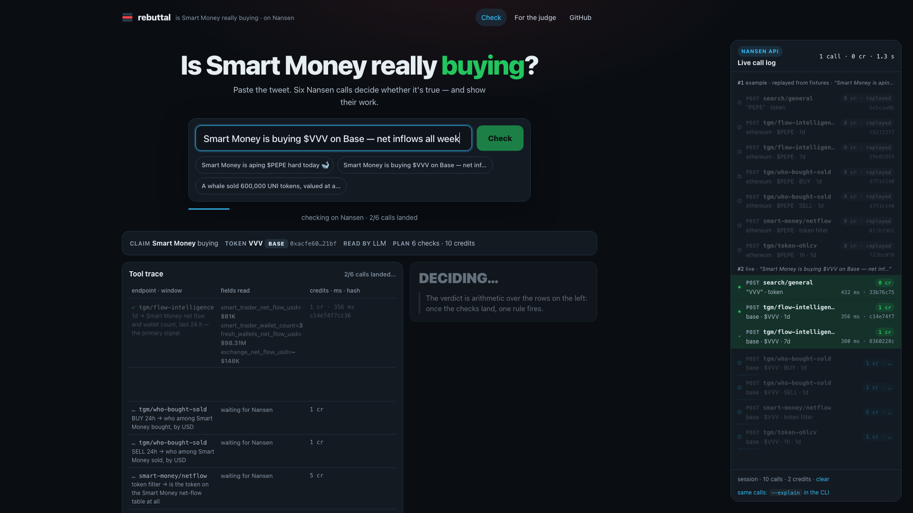
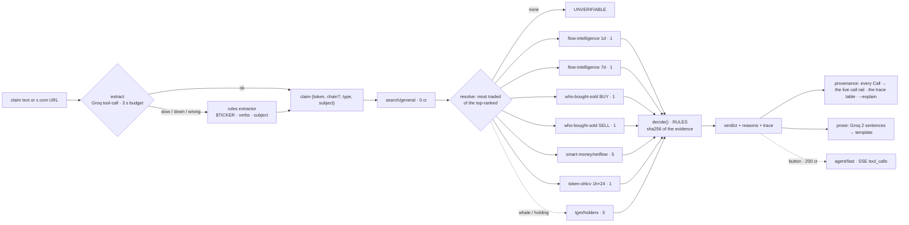

<div align="center">



<h1>Rebuttal 🔴</h1>
<p><em>Paste "Smart Money is buying $X". Six Nansen calls decide whether it's true — and show their work.</em></p>



<p>The verdict is deterministic arithmetic over Nansen label-class flows — one of four words, the rule that fired, the numbers, a sha256 of the evidence, the full tool trace. An LLM only reads the claim and writes two sentences; when it is down, rules and a template take over and the verdict does not change. <code>npm run verify</code> replays 13 recorded rebuttals offline and reproduces every hash.</p>

<br/>

[](https://rebuttal.edycu.dev)
[](https://rebuttal.edycu.dev/judge)
[](https://nansen.ai/campaigns/meridian-buildathon)

<br/>


[](LICENSE)
[](https://github.com/edycutjong/rebuttal/actions/workflows/ci.yml)
[](https://github.com/edycutjong/rebuttal/releases/latest)

</div>

---

## 📸 See it in Action


| Claim in | What the six calls found (live, 2026-09-18) | Verdict |
|---|---|---|
| `Smart Money is aping $PEPE hard today 🐋` | PEPE resolves to ethereum (most traded of 14 same-name at the recording; 13 on 2026-09-19 — the search index moves); Smart Trader net flow 24 h **$0, 0 wallets**; 7 d +$5K over 53 wallets; on the Smart Money table with 89 traders; fresh wallets bought $1.14M | **CONTRADICTED** · `C-NOBODY` |
| `A whale sold 600,000 UNI tokens, valued at approximately $5.1 million.` | Whale-labelled holders' balances fell **$532K** in 24 h (10 wallets, threshold $77K); 7 d −$460K; price +31.7 % | **CONFIRMED** · `A-FLOW` |
| `Smart Money is buying $VVV on Base — net inflows all week` | Smart Trader net +$100K / 24 h (4 wallets), +$115K / 7 d, #2 on the Smart Money table; fresh wallets +$73.9M (context, not a downgrade) | **CONFIRMED** · `A-FLOW` |
| `Zcash whales accumulate … $ZEC` | Zcash is not a chain Nansen indexes — refused before any call | **UNVERIFIABLE** · `U-CHAIN` · 0 credits |

Every rebuttal streams its **tool trace** as the calls land: endpoint, window, the fields that entered the rule with their values, credits, latency, cached or live, and the sha256 of the response. The CLI prints the same rows with `--explain`. One button runs the same claim through Nansen's own `agent/fast` (its **200-credit price printed on the button**) and shows its `tool_calls` beside our trace — two agents, one claim.

| The claim, as read, and the plan | Rows landing live | Mobile — the trace stacks at 390 px |
|---|---|---|
|  |  |  |

<p align="center"></p>
<p align="center"><sub>The <b>Nansen call rail</b> (right): every call as it leaves and lands — <code>POST endpoint</code> · token · window · credits · ms · sha256 — from the same <code>Call</code> objects the trace prints. Below 1280 px it docks as a bottom sheet.</sub></p>

## 💡 The Problem & Solution

### The Problem

Dani saw "Smart Money is aping $PEPE hard today 🐋" with 4,000 likes and thirty seconds before the candle closed. Checking it means opening Nansen, knowing which of ten Token God Mode screens to read, and knowing that "Smart Money" is a specific label class with specific net-flow numbers. Nobody does that in thirty seconds, so the claim wins by default — and the tweet is the exit liquidity ad.

### The Solution

**Rebuttal** takes the sentence as input. It extracts the token, chain and claim type, resolves the token on Nansen, plans the checks that claim type needs, runs them in parallel, and returns **CONFIRMED / OVERSTATED / CONTRADICTED / UNVERIFIABLE** with the numbers that decided it.

```
T        = max($5K, 1% × Σ|net flow 1d| over Smart Trader, Whale, Top PnL, Public Figure)
net      = subject's 24 h net flow   (Smart Money: flow-intelligence; whales: holders' balance change × price)
buying:  net ≤ −T                       → CONTRADICTED  C-SIGN
         net ≈ 0 ∧ 0 wallets ∧ class present  → CONTRADICTED  C-NOBODY   (class absent everywhere → UNVERIFIABLE U-NOCLASS)
         0 < net < T                    → OVERSTATED    O-SMALL
         net ≥ T ∧ 7d ≤ −T7             → OVERSTATED    O-7D
         net ≥ T ∧ |Δprice 24h| ≥ 20%   → OVERSTATED    O-STALE
         net ≥ T ∧ wallets < 3 (whales 1) → OVERSTATED  O-FEW
         net ≥ T                        → CONFIRMED     A-FLOW
selling: the mirror image (sign flipped once)   ·   holding: holders' count and 7 d balance change
```

The full rule set with the live numbers is in [docs/SCORING.md](docs/SCORING.md). The LLM never sees these inputs as a question — it is handed the decided record and may only paraphrase it; prose that disputes the label is discarded (a guard that fired in live QA).

## 🏗️ Architecture & Tech Stack

One `rebut()` function, four views. The verdict is arithmetic over Nansen fields; the LLM only reads the claim and writes two sentences.

<p align="center"></p>

<details>
<summary><b>Mermaid source</b> — expand to see the diagram as text (renders on GitHub)</summary>



</details>

| Layer | Choice | Why |
|---|---|---|
| Engine | `packages/core` — `rebut()`: extract → resolve → checks → `decide()` → prose | one function for the CLI, the web route and the permalink |
| Nansen client | fetch + `apikey`, 5 rps bucket, 8 s timeout, 1 retry on 429/5xx/timeout, sha256 `responseHash` on every call, credit table, read-through cache (1 h), `NANSEN_OFFLINE` replay | provenance and credits are exact by construction |
| LLM | Groq `openai/gpt-oss-120b`, OpenAI-compatible tool calling; keys rotated on 429 / restricted; 3 s extraction budget, 4 s prose budget | outside the verified path — `verify`, the tests and CI never need it |
| Web | Next.js 16 App Router on Vercel: NDJSON stream `/api/rebut`, permalink `/c?q=`, `/api/og` card, `/judge`, POST-only `/api/agent` relay | the trace streams as the calls land |
| Guard | 10 checks / IP / min · 2,000 live credits / day then labelled fixture replay · agent 2 / IP / day, 4 / day | a public key-holding route cannot be drained |
| Tests | vitest + fast-check: 352 tests (100% statements/branches/functions/lines on `packages/core/src`), 23,000 property cases, 10,000 generated bad inputs at the route boundary | the label is a pure function of the evidence |

See [ARCHITECTURE.md](ARCHITECTURE.md) for the as-shipped detail.

## 🏆 Nansen Integration

The engine, not decoration — every rule input is a Nansen response field.

| Endpoint | Credits | Fields that enter the rule | Decides |
|---|---|---|---|
| `search/general` (`result_type: token`) | 0 | `tokens[].symbol/name/chain/address/rank/volume_24h/market_cap` | which token the tweet means: same-name matches on scorable chains, the chain named in the text, else the most traded of the top-ranked |
| `tgm/flow-intelligence` (1d and 7d) | 1 × 2 | `smart_trader_net_flow_usd`, `smart_trader_wallet_count`, `whale_*`, `top_pnl_*`, `public_figure_*`, `fresh_wallets_net_flow_usd`, `exchange_net_flow_usd` | **the primary signal** and the threshold's scale; 7 d says blip or trend |
| `tgm/who-bought-sold` (BUY and SELL, 24 h, `include_smart_money_labels`) | 1 × 2 | `data[].address`, `address_label`, `bought_volume_usd` / `sold_volume_usd` | who among Smart Money (Smart Trader, Fund, 30/90/180D Smart Trader) or Whales actually traded — the names in the trace; the primary signal when flow-intelligence fails |
| `smart-money/netflow` (`filters.token_address`) | 5 | `net_flow_24h_usd`, `net_flow_7d_usd`, `trader_count` | is the token on Nansen's Smart Money table at all — context on every card |
| `tgm/token-ohlcv` (1h × 24) | 1 | `data[].open`, `close` | did the price already move — the claim is late (`O-STALE`) |
| `tgm/holders` (`label_type: smart_money` \| `whale`) | 5 · whale / holding claims | `data[].address_label`, `balance_change_24h`, `balance_change_7d`, `value_usd` | whale claims' primary signal (balance change × price, transfers included); holding claims |
| `agent/fast` | 200 · button only | SSE `tool_call.name`, `delta.text`, `finish.tool_calls` | the comparison beat — never part of the verdict |

10 credits per Smart Money claim, 15 per whale or holding claim, 0 on a cache hit, 0 for a refusal. Cached calls are labelled and never counted. On the page, the **Nansen call rail** on the right streams every one of these calls as it leaves and lands — `POST endpoint`, the token and window, the credits charged, the latency and the response hash — from the same `Call` objects the trace table and `--explain` print, so the live meter and the receipt always agree. Failed calls are shown in the trace as "unavailable", never hidden; a rebuttal with fewer than 2 answered checks is UNVERIFIABLE.

### Why only Nansen

"Smart Money" is a Nansen label. A claim about what Smart Money is doing can only be checked against the source of the label — there is no second dataset that defines the class. Take Nansen out and you would need a multi-chain token index, a wallet-labelling graph and a per-label flow aggregator, and you still could not define "Smart Money", so the claim would stay unfalsifiable. There is deliberately no fallback to price or volume: "the price went up" is the argument the tweet is making.

**Not used, on purpose:** `profiler/address/labels` (100 cr) and `premium_labels` (150 cr) — the who-bought-sold and flow-intelligence rows carry the label classes for 1 credit. `agent/expert` (750). What we learned the hard way — including two Nansen endpoints disagreeing about the same 24 h — is in [docs/DX-REPORT.md](docs/DX-REPORT.md).

## 📊 Engineering Rigor

| Metric | Value | Source |
|---|---|---|
| Tests | **352 tests** (`npm test`) — **100% core coverage** (statements/branches/functions/lines on `packages/core/src`, enforced by `vitest.config.ts` coverage thresholds) | `packages/core/test/` |
| Property-based verification | **23,000 generated cases** (fast-check): `decide()` is pure, always one of four labels, selling is the exact mirror of buying; `extractClaim()` never throws on any string | `packages/core/test/property.test.ts` |
| Route boundary | **10,000 generated bad inputs** → 400 with zero fetches; the key never appears in a verdict, an event, the trace or an error; the agent never runs on a GET | `packages/core/test/guard.test.ts` |
| Spike on real posts | 10 claims from Lookonchain / OKX feeds (2026-09-14 → 18): **7/10 decisive**, 3 honest refusals; extraction LLM 10/10, rules 10/10 | recorded in the kitchen; the claims are `packages/core/test/claim.test.ts` |
| Fixtures | 13/13 rebuttals reproduced offline — same label, rule and hash, zero network, zero credits, zero LLM | `npm run verify`, `fixtures/*.json` |
| Cold latency | p50 **4.0 s** · p95 **5.0 s** (13 claims × 2 runs, live, LLM on) | [docs/BENCH.md](docs/BENCH.md) |
| Warm latency | p50 **2 ms** | [docs/BENCH.md](docs/BENCH.md) |
| Credits per rebuttal | mean **10.0**, max 15; 0 of 154 live calls failed | [docs/BENCH.md](docs/BENCH.md) |
| Clean clone → first verdict | **19 s** (clone 2 · install 3 · live rebuttal 2 · verify 1 · tests 3 · build 8) | timed on a fresh clone at HEAD, 2026-09-18 |

### Honesty

- **Fixtures are replays, the default path is live.** `fixtures/*.json` hold 13 real rebuttals recorded on 2026-09-18 with every raw Nansen response byte-for-byte and the claim as extracted (so a replay needs no LLM key). `npm run verify` replays them with `NANSEN_OFFLINE=1` and requires the same label, rule and hash and zero network calls. The CLI never reads them; the web app reads one for the idle example (labelled), and otherwise only when the day's live credit ceiling is spent (the `/` stream then replays with a warning; past the per-minute gate `/` answers 429 while the permalink and the share card replay with a rate message).
- **The LLM cannot change the verdict.** It extracts the claim (a `$TICKER` and a strong verb in the text are final; it may correct a guessed token only with one that appears in the text; a subject keyword beats its guess; a chain it names must appear in the text; a negated claim — "Smart Money is NOT buying $X" — stays a refusal whatever the model reads) and paraphrases the decided record. Prose that disputes the label is discarded and the template ships — `packages/core/src/llm.ts`.
- **Numbers come from scripts.** [docs/BENCH.md](docs/BENCH.md) is the output of `npm run bench`. Net flows are priced at current rates and drift by the minute; the hash covers integers of the numbers that decided the label, so a fixture replay always matches and a live re-run usually does.

### Honest limits (7)

1. **"Smart Money" here means the Smart Trader flow columns plus the Fund / Smart Trader rows named in the trace.** Funds have no separate flow-intelligence column; the who-bought-sold label filter covers them.
2. **Nansen's Whale label is sparse.** A post's "whale" is usually a big wallet Nansen does not tag; when no Whale-labelled wallet exists in the token the tool says UNVERIFIABLE (`U-NOCLASS`) rather than pretending a CONTRADICTED. In the spike that was 2 of 7 whale claims.
3. **Ambiguous tickers resolve to the most-traded token among the top-ranked** — `MEME` picks Robinhood-chain "A Meme Coin" over ethereum Memecoin. Name the chain in the claim, or pass `--chain`.
4. **Coins whose home chain Nansen does not index** (BTC, ZEC, XRP, ADA, DOGE, …) are refused unless a chain is named — only bridged copies exist on Nansen and they are not what the post is about. A chain named in the claim is the question, not a tiebreak: "$PEPE on base" checks base's PEPE, and if Nansen has none there the answer is UNVERIFIABLE (`U-TOKEN`), never another chain's book.
7. **A negated claim is refused, not inverted.** "Smart Money is NOT buying $X" is a denial; the rules check what a class did, so the tool names the positive form and refuses at 0 credits (`U-CLAIM`) rather than answering the opposite question.
5. **Two Nansen endpoints can disagree about the same 24 h**: for HYPE, `tgm/flow-intelligence` 1d said Smart Trader +$291K over 263 wallets while `smart-money/netflow` said +$207 over 109 traders. Flow-intelligence is the primary; the table line is context and both numbers are shown.
6. **The 24 h window can miss a slow accumulation**; the 7 d window and the holders check exist for that, and OVERSTATED is the honest answer when they disagree.

## 🚀 Getting Started

### Prerequisites

- Node 22 (20+ works)
- A Nansen API key from [app.nansen.ai/api](https://app.nansen.ai/api) — the only required configuration

### Installation

```bash
git clone https://github.com/edycutjong/rebuttal && cd rebuttal
npm install                                                # ~3 s with a warm npm cache
export NANSEN_API_KEY=nsn_...                              # one env var
npm run rebuttal -- "Smart Money is aping \$PEPE hard today"   # 10 credits, ~4 s cold; 0 credits on the second run
```

### Run it in under 10 minutes

```bash
npm run rebuttal -- "Smart Money is aping \$PEPE hard today" --explain   # every rule input, every call, the copy text
npm run rebuttal -- "https://x.com/lookonchain/status/2099673587125014572"   # an x.com link: the tweet's text is fetched, then checked
npm run rebuttal -- "A whale sold 600,000 UNI" --ask-nansen               # + Nansen's own agent/fast, 200 credits, its tool list printed
npm run verify                                                           # replays 13 recorded rebuttals offline — no key, no network, 13/13
npm run dev                                                              # http://localhost:3400
```

Optional: `export GROQ_API_KEY=…` (or `GROQ_API_KEYS=a,b,c`) turns on the LLM extractor and the two-sentence prose. Without it the rules extractor and the template run, and the output says so — the verdict is identical.

Measured on a clean clone from GitHub (macOS, Node 22, warm npm cache, 2026-09-18 12:35 UTC, HEAD): clone 2 s · install 3 s · first live rebuttal 2 s (10 credits) · `verify` 1 s · tests 3 s · `next build` 8 s — **19 s of machine time** plus pasting the API key. Re-timed by an independent audit on 2026-09-19 following [JUDGE.md](JUDGE.md) literally (no build step): clone 2 · install 3 · live rebuttal 3 · verify <1 · tests 3 — **11 s**.

## 🧪 Testing & CI

**Pipeline (`ci.yml`, CI/CD Pipeline):** Quality (typecheck core + web · 352 tests, 100% core coverage · offline replay · readiness) ∥ Security (TruffleHog on the full history · npm audit) → Build (Next.js, no key, bundle budget) → E2E smoke (`npm run e2e` against the built app, no key) → Deploy gate → **Production deploy** on every push to `main`: `vercel pull` → `vercel build --prod` → `vercel deploy --prebuilt --prod` → alias, into the `production` environment at [rebuttal.edycu.dev](https://rebuttal.edycu.dev). No API key anywhere in CI — the only secret is the Vercel token. The same steps run locally as `npm run ci:full`; a manual deploy is `vercel build --prod && vercel deploy --prebuilt --prod`, then re-alias.

**Security:** CodeQL (GitHub default setup — code scanning on every push and PR) · gitleaks on the full history (`gitleaks.yml`, `.gitleaks.toml` allowlists public token addresses) · TruffleHog · Dependabot (npm + actions, grouped) · `npm audit` — 0 open alerts, 0 vulnerabilities.

**Releases:** `release.yml` — semantic tags from Conventional Commits (feat → minor · fix/perf → patch · `!`/BREAKING CHANGE → major), cut after the CI/CD Pipeline passes on main: every package.json bumped, `chore(release): vX.Y.Z [skip ci]`, annotated tag, GitHub Release with generated notes. The same algorithm runs locally as `npm run release` (`--dry-run` to preview) when Actions is unavailable — see [CONTRIBUTING.md](.github/CONTRIBUTING.md). The footer of every page shows the deployed version.

```bash
npm run typecheck      # tsc strict, core + scripts + web
npm test               # 352 vitest tests incl. 23,000 property cases — 100% core coverage
npm run verify         # 13/13 fixtures, 0 network
npm run check          # README claims vs the tree, kitchen/secret scan, history scan
npm run e2e            # build first; route smoke of the built app (--url https://… for a deployment, --live adds the hero claim)
npm run bench          # live: cold/warm p50/p95, credits per rebuttal → docs/BENCH.md (≈ 130 credits per run)
npm run seed           # live: re-record the 13 fixtures (≈ 125 credits)
```

## 📁 Project Structure

```
packages/core/src   client.ts cache.ts nansen.ts   — Nansen client, cache, typed endpoint wrappers
                    claim.ts resolve.ts checks.ts  — extraction (rules), token resolution, the check plan
                    decide.ts rebut.ts             — the rules and the orchestrator (hash, prose, events)
                    llm.ts agent.ts tweet.ts       — Groq (extract + narrate, guarded), agent/fast SSE, x.com oEmbed
packages/cli/src    cli.ts                         — npm run rebuttal -- "<claim>" [--explain --json --chain --no-cache --no-llm --ask-nansen]
apps/web            app/ (page, c, judge, api/rebut, api/agent, api/og) · components/ · lib/guard.ts
fixtures/           13 recorded rebuttals (raw responses, claim, clock, verdict)
scripts/            spike.ts seed.ts verify.ts bench.ts check_submission_readiness.ts
docs/               SCORING.md BENCH.md DX-REPORT.md screenshots/
```

## 📽️ Demo Materials

- [DEMO.md](DEMO.md) — verbatim CLI output, the bench, reproduce steps
- [JUDGE.md](JUDGE.md) — the 30-second path, receipts, limitations (mirrors [/judge](https://rebuttal.edycu.dev/judge))
- Live: [rebuttal.edycu.dev](https://rebuttal.edycu.dev)

## 📄 License

MIT — see [LICENSE](LICENSE). Built by [@edycutjong](https://x.com/edycutjong) for the Nansen Meridian Buildathon, September 2026. Not financial advice.
